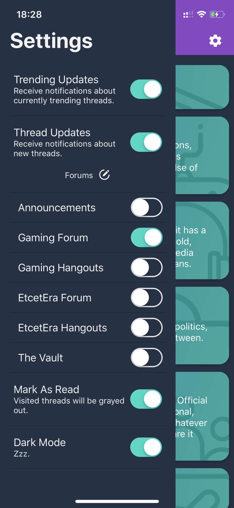

# Resetera Mobile Reader

A mobile reader for Resetera powered by
[resetera-api](https://github.com/BFriedrichs/resetera-api).

## Features
This app does not include any login or interactive features but rather is meant to act as a way to read and scroll through the forum.

### Forum
All forums as listed on Resetera itself.

## Settings
Notifications are sent out for new trending threads or for each new topic in a forum. These can get a little much since there is a lot going on usually.
Threads in the list of threads will be visually greyed out when read if the option is turned on.

## List of threads
Includes date posted, any modifiers (sticky / locked / poll) as an icon and the hit / comment counts.

## Post
The post themselves feature more or less all functionality that is present. Tweets, embeds and images are displayed. Links to Resetera threads are deeplinked, other links open in the standard browser. Polls are displayed as seen in the pictures.

## Development
### Start Debugging
open "rndebugger://set-debugger-loc?host=localhost&port=19001"